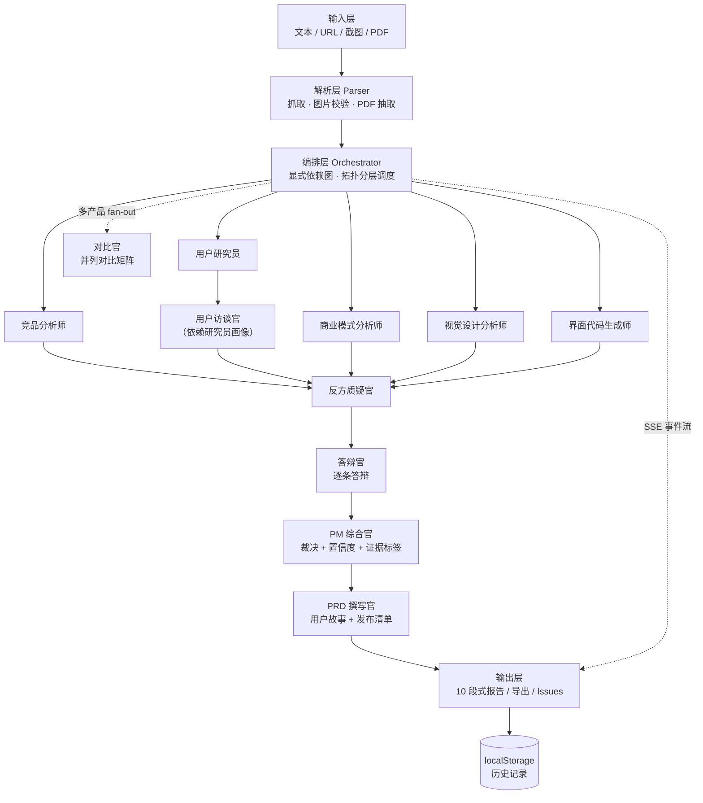

# Key · AI 产品拆解助手

> 把任何产品拆成关键洞察。

🌐 **在线体验**：https://key-ai-teardown.vercel.app ｜ **源码**：https://github.com/parzival-ftk/key-ai-teardown

Key 是一个面向 **AI 产品经理 / 产品经理** 岗位的**面试作品集项目**：输入一个产品（或一个想法），它像一位产品经理那样完成一次结构化拆解 —— 竞品格局、用户与 JTBD、模拟访谈、视觉设计、商业模式、反方质疑、答辩、综合裁决，直到一份**可直接开发的中文 PRD** 与**界面参考代码**。输入 2-3 个产品时，它还能产出**并列对比矩阵**。

## 一条主线：让 AI 的自信变得**可追责**

它不是一个黑盒调 API 的套壳。四个环节环环相扣，构成一条完整叙事：

1. **看见** —— 10 个角色的编队经 SSE **实时直播**，推理逐字可见，而不是一个转圈等待。
2. **可追溯** —— 每条关键结论带 `已核实 / 推测 / 缺失` 证据标签与 0-100 置信度。硬约束：**「已核实」必须能机械核验回本次输入**，否则自动降级为「推测」（治理假引用）；报告顶部给出「可追溯输入」占比。
3. **一致** —— **画像先行**：用户研究员先立 persona，访谈官以**同一套画像**展开访谈（依赖在图里显式声明），避免两段 persona 各说各话。
4. **经得起质询** —— 反方质疑官先挑战假设，**答辩官**逐条答辩（接受 / 反驳 / 存疑），综合官做**裁决**；分歧在报告里显式呈现，而不是被抹平。

## 亮点

- **10 个角色的编队**：竞品 / 用户研究 / 访谈 / 视觉设计 / 商业模式 5 个分析师**并行** → 访谈官 → 反方质疑官 → 答辩官 → 综合官 → PRD 撰写官；SSE 流式实时点亮，单点失败不阻塞整体。
- **可追责的可信度层**：证据标签 + 置信度 + 「可追溯输入」总览；结论可展开 `结论 → 来源`；导出 Markdown 同样带标签。
- **真辩论**：质疑 → 答辩 → 裁决，**单轮收敛**（依赖图无环 + 框架层收敛纪律），不无限辩论。
- **对比矩阵**：一次输入 2-3 个产品，各自独立拆解后由「对比官」产出并列对比表；编排层 fan-out **并发受限**（成本 / 速率护栏）。
- **界面参考代码**：视觉设计拆解 + HTML / Tailwind 代码起点（可复制、可轻量画布预览并改 class）。
- **成套分析框架**（13 个）：波特五力、SWOT、竞品画像（威胁等级）、JTBD、商业模式画布（含单位经济学）、AARRR、模拟用户访谈、视觉设计拆解、界面代码还原、对比矩阵等。
- **四类输入源**：文本、URL、截图（多模态识别）、PDF（文本抽取）。URL 走**双路**——正文抓取 + **无头渲染取 UI 结构（DOM + computed styles）**，纯 JS 渲染页也能拿到界面结构。
- **交付物完整**：10 段式报告可导出 Markdown；PRD 用户故事一键转 **GitHub Issues**。
- **质量门禁**：`npm run eval` 以 judge 按 rubric 打分，并与基线对比「改动前 / 后」的质量变化。
- **断网可演示**：内置**样例报告**与**样例对比**，无 Key / 无网络也能完整走一遍。

---

## 技术栈

| 层 | 选型 |
|---|---|
| 框架 | Next.js 16（App Router）+ TypeScript |
| 样式 | Tailwind CSS 4 |
| LLM | 自研 Provider 抽象（OpenAI 兼容协议，一套接口切 DeepSeek / OpenAI / 通义 / 智谱） |
| 编排 | 自研轻量**显式依赖图**（拓扑分层调度，非 LangGraph，可控可讲） |
| 流式 | SSE（`ReadableStream` 事件流） |
| PDF | unpdf |
| 测试 | Vitest（单元 + 集成，264 用例）；质量门禁 eval 为独立 CLI |

> 不引入 LangGraph / CrewAI：编排逻辑简单（依赖图 + 事件流），自研可控、易讲清设计决策。

---

## 快速开始

```bash
# 1. 安装依赖
npm install

# 2. 配置模型（复制模板并填入你的 Key，四家任选其一）
cp .env.example .env

# 3. 启动
npm run dev
```

打开 http://localhost:3000 —— 输入产品名即可开始；没有 Key 时可点首页「查看样例报告」或「多产品对比 → 查看样例对比」。

### 环境变量

| 变量 | 说明 |
|---|---|
| `LLM_BASE_URL` | 厂商 OpenAI 兼容端点（见 `.env.example`） |
| `LLM_API_KEY` | 你的 API Key（必填） |
| `LLM_MODEL` | 模型名，如 `deepseek-chat` |
| `LLM_TIMEOUT_MS` | 单次调用总超时（毫秒，可选，默认 60000） |
| `CHROME_PATH` | 可选：指定 Chrome/Edge 可执行文件路径（URL 无头渲染用；缺省自动探测系统安装，探测不到则降级为正文抓取） |

---

## 架构



**边界原则**：每个 Agent 是纯函数式单元（`ProductBrief` + 依赖 → 输出），可脱离 UI 与网络独立测试；编排层只负责**调度与依赖**，不含业务提示词（提示词集中在 `lib/frameworks/`）。

---

## 目录结构

```
app/                   页面与 API 路由
  (页面)               / · /analyze/[id] · /report/[id] · /history · /sample
                       /compare · /compare/[id] · /compare/sample
  api/                 analyze(SSE) · compare(SSE) · export · parse · health
components/            输入表单（单产品 / 多产品对比）、分析直播、报告、对比视图、历史
lib/
  agents/              编排器 + 10 个 Agent + 流式补全 + 结构化输出解析
  compare/             对比矩阵：并发受限 fan-out + 对比编排 + SSE 封装
  frameworks/          分析框架提示词库（含 prd-templates/、对比官提示词）
  llm/                 Provider 抽象与 OpenAI 兼容实现
  parsers/             URL / 图片 / PDF 解析 · dom（无头渲染取 UI 结构）
  export/              报告 Markdown 与 PRD→GitHub Issues
  report/              报告章节定义（单一事实来源）
  types/               共享契约（ProductBrief / CompareBrief / AgentEvent / Evidence）
eval/                  质量门禁：rubric · judge · 基线与对比 · CLI（npm run eval）
scripts/               演示冒烟脚本（npm run demo）
docs/                  设计规格 · 演示脚本
```

---

## 质量门禁与测试

```bash
npm run test        # Vitest：单元 + 集成（264 用例）
npm run typecheck   # tsc --noEmit
npm run lint        # ESLint（Next 16 flat config）
npm run build       # 生产构建
npm run eval        # 质量门禁：judge 按 rubric 打分并与基线对比（需真实 LLM）
```

- **单元 / 集成测试**：覆盖 Agent 输出解析、SSE 事件序列、依赖图调度、Provider 请求构造、解析器、导出转换、历史存储等；集成测试以 stub LLM server 驱动**完整编队**走真实 HTTP；**无头渲染**另有一条真实浏览器集成用例（本机无 Chrome/Edge 时自动跳过）。
- **质量门禁（eval）**：固定的 golden briefs → 跑完整编队 → judge 按 4 个维度（框架覆盖度 / 证据可追溯性 / 洞察深度 / 可执行性）打分 → 与 `eval/baseline.json` 对比，输出「改动前 / 后」质量对比表。
  > 纪律：judge 是**代理指标、有噪音**，分数只用于同一 rubric 下的相对比较，不得当真理。

---

## 演示

面试演示的完整剧本（含讲解主线、逐步操作与降级路径）见 **`docs/demo.md`**。

一键冒烟校验（对已运行的 dev server 校验演示路径上的关键端点）：

```bash
npm run dev          # 终端 A：启动
npm run demo         # 终端 B：校验 / · /sample · /compare · /compare/sample · /api/health
```

---

## 部署

已部署于 https://key-ai-teardown.vercel.app （公开访问）。项目为标准 Next.js 应用，可一键部署到 Vercel：

1. 推送到 GitHub；
2. 在 Vercel 导入仓库；
3. 在项目设置中配置环境变量（`LLM_BASE_URL` / `LLM_API_KEY` / `LLM_MODEL`）；
4. 部署。

> 截图输入需所选模型支持多模态（Vision）；若使用纯文本模型，请改用文本 / URL / PDF 输入。
> **URL 无头渲染的部署边界**：headless 取 UI 结构依赖**本机已安装 Chrome/Edge**（可用 `CHROME_PATH` 指定）。Vercel 等 serverless 环境无浏览器，会**自动降级**为正文抓取，不影响其它功能；要在线启用需接入 `@sparticuz/chromium` 或外部渲染服务。

---

## 设计文档

产品定位、竞品格局与差异化、SSE 事件协议、错误降级策略与分波路线见
`docs/superpowers/specs/2026-09-12-key-design.md`。
