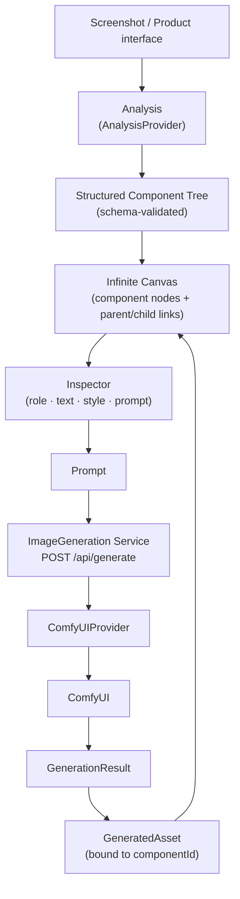
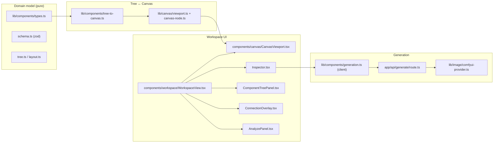

# Key

**AI-powered interface analysis and visual decomposition workspace.**

Upload a product interface screenshot, transform it into a structured component tree, explore the
hierarchy on an infinite canvas, inspect component properties and prompts, and generate visual
assets through ComfyUI.

---

## What it is

Interface work usually starts from a picture and ends in a pile of loose decisions: which parts of
the screen are separate components, which are nested, what each one is supposed to be, and what it
should look like once redrawn.

Key treats that as a first-class workflow instead of a note-taking problem:

- **Read** an interface screenshot into a **structured component tree** (page → section → component → element).
- **Organize** that tree on an **infinite canvas** — pan, zoom, drag, select, parent/child relations.
- **Inspect** any component: its role, text, visual style, and its generation prompt.
- **Generate** visual assets for a component through **ComfyUI**, and drop the result back onto the canvas
  bound to the component it came from.

It is *not* a Figma replacement, and it does *not* generate whole websites. The scope is deliberately
narrow: **understand an interface → decompose it → organize it visually → generate visuals**.

---

## Core flow



---

## Capability status

Capabilities are labelled honestly — nothing is presented as more real than it is.

| Capability | Status | Notes |
|---|---|---|
| Infinite canvas (pan / zoom / drag / select / resize / marquee / layers / fit) | **REAL** | Native Pointer Events, zero canvas framework; viewport math is pure functions in `lib/canvas` |
| Component tree model + deterministic layout | **REAL** | `lib/components` — pure, unit-tested |
| Parent / child relation | **REAL** | Component tree panel + connection overlay drawn from live node geometry |
| Inspector (Name / Type / Role / Description / Text / Visual Style / Prompt) | **REAL** | Field model in `lib/components/inspector-fields.ts` |
| Component prompt (authored or derived) | **REAL** | `lib/components/prompt.ts` |
| Persistence (refresh keeps your project) | **REAL** | localStorage via the existing `KVStore` abstraction |
| ComfyUI visual generation | **REAL** | Server-side `ComfyUIProvider` over HTTP (`/prompt` → `/history` → `/view`); requires a running ComfyUI instance |
| Screenshot analysis → component tree | **DEMO** | No vision model is wired into this flow yet; the default provider returns a deterministic tree and is labelled `demo` in the UI |
| Product teardown / multi-product comparison | **Legacy** | Earlier feature set, kept in the repository; see *Legacy modules* below |

---

## Quick start

```bash
npm install
npm run dev
```

Open http://localhost:3000.

- **Create Project** — starts from a small page skeleton.
- **Example Project** — a built-in *Landing Page* workspace. Open it, select
  `Hero → Illustration`, and use **Generate Visual** to run the whole loop without uploading anything.

---

## Environment variables

Copy `.env.example` to `.env`.

| Variable | Purpose |
|---|---|
| `LLM_BASE_URL` / `LLM_API_KEY` / `LLM_MODEL` | OpenAI-compatible endpoint used by the legacy product-teardown modules |
| `LLM_TIMEOUT_MS` | Optional per-call timeout (default 60000) |
| `COMFYUI_BASE_URL` | ComfyUI base URL (default `http://127.0.0.1:8188`) |
| `COMFYUI_CHECKPOINT` | Default checkpoint filename; if omitted the provider falls back to its own default |
| `COMFYUI_TIMEOUT_MS` | Per-generation wait limit (default 120000) |
| `COMFYUI_ARTIFACT_DIR` | Where generated images are written (default `.rivet/artifacts/comfy`) |

---

## ComfyUI setup

Generation is a real provider call, not a simulation:

```
Component prompt
  → GenerationRequest
  → ImageGeneration Service (POST /api/generate)
  → ComfyUIProvider
  → ComfyUI
  → GenerationResult
  → GeneratedAsset (bound to the component)
```

1. Run ComfyUI locally (default `http://127.0.0.1:8188`) and make sure at least one checkpoint is installed.
2. Set `COMFYUI_CHECKPOINT` if the default checkpoint name does not match your installation.
3. Check the connection:

```bash
npm run comfy:doctor    # inspects the instance's /object_info and validates the workflow against it
npm run comfy:e2e       # live text-to-image end-to-end run
```

If ComfyUI is unreachable, the UI shows a **structured** error (`code: message`) instead of a generic
failure. Failure stages are classified as `CONFIG_ERROR`, `COMFYUI_UNAVAILABLE`, `SCHEMA_INVALID`,
`WORKFLOW_INVALID`, `QUEUE_ERROR`, `EXECUTION_ERROR`, `OUTPUT_NOT_FOUND`, `IMAGE_DOWNLOAD_ERROR`.

---

## Architecture



Principles the codebase follows:

- **The component tree is the domain model**; `CanvasNode` is the canvas model. They are bridged by pure
  functions, so a canvas change never leaks domain semantics and vice versa.
- **Layout and geometry are pure functions.** No DOM measurement, no `setState` inside effects during layout.
- **AI/analysis JSON never reaches the canvas unchecked** — it is validated against a zod schema and
  normalised into the flat component tree first.
- **One provider boundary per external system** (`AnalysisProvider`, `ImageGenerationProvider`), so backends
  can be swapped without touching the UI.

### Key directories

```
app/
  page.tsx                     home (Create / Recent / Example)
  project/[id]/page.tsx        project workspace
  api/generate/route.ts        generation boundary (thin)
components/
  canvas/CanvasViewport.tsx    infinite canvas (controlled + uncontrolled modes)
  workspace/                   WorkspaceView, Inspector, ComponentTreePanel, ConnectionOverlay, AnalyzePanel
  home/HomeView.tsx            home view
lib/
  components/                  component tree model, schema, layout, project store, analysis, generation
  canvas/                      viewport math, layer model, ComfyUI bridge, schema doctor
  image/                       ImageGenerationProvider abstraction + ComfyUI provider
  hooks/client-snapshot.ts     localStorage reads via useSyncExternalStore
```

---

## Tests

```bash
npm run lint        # ESLint
npm run typecheck   # tsc --noEmit
npm test            # Vitest (unit + integration)
```

Live ComfyUI checks are separate opt-in scripts (they need a real instance):

```bash
npm run comfy:doctor
npm run comfy:e2e
```

---

## Example Project

The repository ships a built-in **Example Workspace** (`Landing Page`) so the product can be tried
without first uploading a screenshot:

```
Landing Page
├── Header
├── Hero
│   ├── Title
│   ├── SearchBox
│   └── Illustration   ← has a ready-to-use generation prompt
├── Features
└── Footer
```

It is a normal project — editable and persisted like any other.

---

## Screenshots

Screenshots are captured from a local run and belong in `docs/screenshots/`. No screenshots are
committed yet; until they are, run `npm run dev` and open the Example Project to see the workspace.

---

## Known limitations

- **Screenshot analysis is DEMO.** The default `AnalysisProvider` returns a deterministic component tree
  labelled `demo`. Wiring a real vision model means replacing the provider — the canvas and Inspector do
  not change.
- Projects are stored per-browser (localStorage). There is no account system or server-side storage, so
  projects do not follow you across machines, and clearing site data removes them.
- Generated images live in `COMFYUI_ARTIFACT_DIR` and are referenced by ComfyUI's `/view` URL; the app does
  not copy them into its own asset store.
- The canvas is tuned for roughly 100 nodes. It is not a WebGL renderer and does not target large-scale
  graph editing, multiplayer, or real-time cloud sync.
- ComfyUI must be reachable **from the browser** for a generated image to display, since the canvas loads
  it from the provider's `/view` URL.
- The legacy product-teardown modules still expect LLM credentials and are not wired into the current home
  page.

---

## Legacy modules

The repository began as a product-teardown assistant (competitive landscape, user research, JTBD,
interviews, business model, red-teaming, rebuttal, synthesis, PRD, UI reference code, multi-product
comparison, quality-gate `eval`). Those routes (`/sample`, `/compare`, `/history`, `/resources`) and their
libraries remain in the codebase and are still tested; they are simply not part of the interface-analysis
product surface.

```bash
npm run stub:llm    # stub LLM server for integration tests
npm run demo        # smoke-check the legacy demo endpoints against a running dev server
npm run eval        # quality gate for the legacy report pipeline (needs a real LLM)
```
