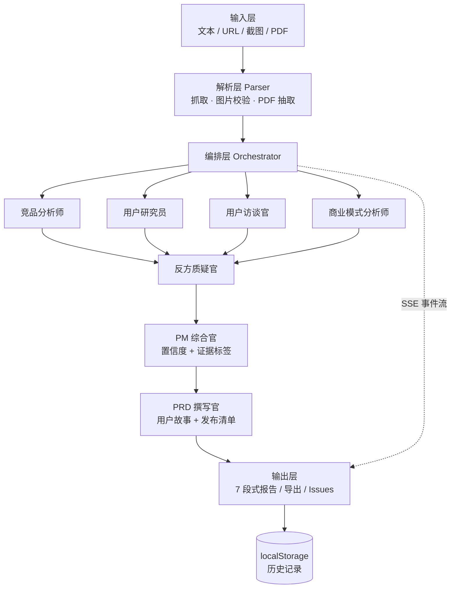

# Key · AI 产品拆解助手

> 把任何产品拆成关键洞察。

Key 是一个面向 **AI 产品经理 / 产品经理** 岗位的**面试作品集项目**：输入一个产品（或一个想法），它像一位产品经理那样完成一次结构化拆解 —— 竞品格局、用户与 JTBD、商业模式、反方质疑、综合结论，直到一份**可直接开发的中文 PRD**。

它不是一个黑盒调 API 的套壳：**分析过程可解释**（多 Agent 流水线实时可见）、**结论带证据标签与置信度**（治理幻觉）、**每个环节都有独立测试**。

---

## 亮点

- **多 Agent 流水线**：4 个分析 Agent 并行 → 反方质疑官（辩论）→ PM 综合官（收敛）→ PRD 撰写官，SSE 流式实时点亮。
- **可解释的推理**：前端直播每个 Agent 的输出；结论标注 `已核实 / 推测 / 缺失` 证据标签与 0-100 置信度。
- **成套分析框架**：波特五力、SWOT、竞品画像（威胁等级）、JTBD、商业模式画布（含单位经济学）、AARRR、模拟用户访谈。
- **四类输入源**：文本、URL 抓取、截图（多模态识别）、PDF（文本抽取）。
- **交付物完整**：7 段式拆解报告，可导出 Markdown；PRD 用户故事一键转 **GitHub Issues**。
- **断网可演示**：内置样例报告，无 Key / 无网络也能完整走一遍。
- **双模式**：拆解产品（Teardown）与共创想法（Co-create）。

---

## 技术栈

| 层 | 选型 |
|---|---|
| 框架 | Next.js 16（App Router）+ TypeScript |
| 样式 | Tailwind CSS 4 |
| LLM | 自研 Provider 抽象（OpenAI 兼容协议，一套接口切 DeepSeek / OpenAI / 通义 / 智谱） |
| 编排 | 自研轻量 DAG（非 LangGraph，可控可讲） |
| 流式 | SSE（`ReadableStream` 事件流） |
| PDF | unpdf |
| 测试 | Vitest（单元 + 集成） |

> 不引入 LangGraph / CrewAI：编排逻辑简单（DAG + 事件流），自研可控、易讲清设计决策。

---

## 快速开始

```bash
# 1. 安装依赖
npm install

# 2. 配置模型（复制模板并填入你的 Key，四家任选其一）
cp .env.example .env

# 3. 启动
npm run dev
```

打开 http://localhost:3000 —— 输入产品名即可开始；没有 Key 时可点首页「查看样例报告」。

### 环境变量

| 变量 | 说明 |
|---|---|
| `LLM_BASE_URL` | 厂商 OpenAI 兼容端点（见 `.env.example`） |
| `LLM_API_KEY` | 你的 API Key（必填） |
| `LLM_MODEL` | 模型名，如 `deepseek-chat` |
| `LLM_TIMEOUT_MS` | 单次调用总超时（毫秒，可选，默认 60000） |

---

## 架构



**边界原则**：每个 Agent 是纯函数式单元（`ProductBrief` + 依赖 → 输出），可脱离 UI 与网络独立测试；编排层只负责调度，不含业务提示词（提示词集中在 `lib/frameworks/`）。

---

## 目录结构

```
app/               页面与 API 路由（/、/analyze/[id]、/report/[id]、/history、/sample、/api/*）
components/        输入表单、分析直播、7 段式报告、历史列表
lib/
  agents/          编排器 + 7 个 Agent + 结构化输出解析
  frameworks/      分析框架提示词库（含 prd-templates/）
  llm/             Provider 抽象与 OpenAI 兼容实现
  parsers/         URL / 图片 / PDF 解析
  export/          报告 Markdown 与 PRD→GitHub Issues
  report/          报告章节定义（单一事实来源）
  types/           共享契约（ProductBrief / AgentEvent / Evidence）
docs/superpowers/specs/   产品设计规格
```

---

## 测试

```bash
npm run test        # Vitest：单元 + 集成
npm run typecheck   # tsc --noEmit
npm run build       # 生产构建
```

测试覆盖 Agent 输出解析、SSE 事件序列、Provider 请求构造、解析器、导出转换、历史存储等；集成测试以 stub provider 驱动完整编排链路。

---

## 部署

项目为标准 Next.js 应用，可一键部署到 Vercel：

1. 推送到 GitHub；
2. 在 Vercel 导入仓库；
3. 在项目设置中配置环境变量（`LLM_BASE_URL` / `LLM_API_KEY` / `LLM_MODEL`）；
4. 部署。

> 截图输入需所选模型支持多模态（Vision）；若使用纯文本模型，请改用文本 / URL / PDF 输入。

---

## 设计文档

产品定位、竞品格局与差异化、SSE 事件协议、错误降级策略与分波路线见
`docs/superpowers/specs/2026-09-12-key-design.md`。
