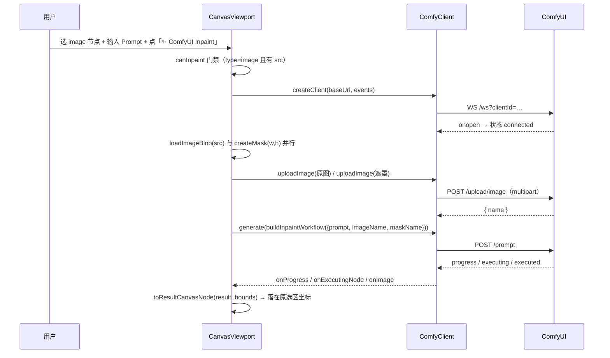

# HANDOFF · KEY（AI 产品拆解助手）

> 本文档写给**没有任何上下文**的接手者（agent 或人）。全文自包含，不引用任何会话记录。
> 仓库：`D:\yinyong\Tianshu\KEY` ｜ 分支：`main` ｜ 撰写时 HEAD：`372aee0`（W31 画布接线功能提交）｜ 日期：2026-09-15（W17–W31 后更新）
> 位置：`docs\HANDOFF.md` —— W22 起从 `.rivet\` 迁出，纳入版本管理随仓库分发（原先在 `.rivet\` 下不受 git 跟踪）。

---

## 任务目标

**这个仓库在做什么**：一个面向「AI 产品经理 / 产品经理」岗位面试的 **Web 作品集项目** —— 输入一个产品（或一个想法），它像产品经理一样做结构化拆解（竞品 / 用户与 JTBD / 访谈 / 视觉设计 / 商业模式 / 反方质疑 / 答辩 / 综合裁决 / PRD / 界面代码），输入 2-3 个产品时产出并列对比矩阵。

**产品主线（写代码时的判断依据）**：**让 AI 的自信变得可追责** —— 看见（SSE 实时直播）→ 可追溯（证据标签且「已核实」必须能机械核验回输入）→ 一致（画像先行）→ 经得起质询（质疑→答辩→裁决）。

**明确的非目标**（设计规格 `docs\superpowers\specs\2026-09-12-key-design.md` §1 已锁定，不要顺手做）：多用户账号 / 权限 / 团队协作；商业化（支付、计费、多租户）；移动端完美适配；自研大模型。

**技术栈**：Next.js 16（App Router）+ TypeScript + Tailwind 4 + Vitest。**零额外基建**：无数据库（历史走 localStorage）、无 Playwright、无图表库、无表单库、无 testing-library。新增能力一律自研（Figma/XState 导出、语法高亮、Diff、加权排名都是零依赖纯函数）。

---

## 已完成

### 门禁现状（撰写时实测，命令可复现）

| 命令 | 结果 |
|---|---|
| `npm run lint` | exit 0（0 problems） |
| `npm run typecheck` | exit 0 |
| `npm run test` | **979 passed / 100 files**（连续两次全量跑均全绿） |
| `npm run build` | exit 0 |

其它入口：`npm run dev`（开发）· `npm run demo`（对已运行的 dev server 冒烟校验 5 个端点）· `npm run eval`（质量门禁 CLI，见下）。

### 本会话完成的工作（W22–W31，按提交倒序；共 13 提交）

| 提交 | 内容 |
|---|---|
| `372aee0` | feat(w31)：画布接通 ComfyUI Inpaint（选区浮条 + 粘贴/拖入图片 + 上传 → 提交 → 进度 → 落图） |
| `1e4dec8` | fix(w30)：修 `connect()` 永久挂起 + LoadImage 契约（改用已上传文件名 + `uploadImage`） |
| `cec9cb5` | feat(w30)：ComfyUI 桥接（inpaint workflow 构造 + WebSocket 状态流 + 结果落回画布坐标） |
| `9d9f42b` | feat(w29)：Figma 式无限画布（视口数学 + 图层模型 + Pointer Events 交互组件 + `/canvas` 页） |
| `72c8eee` | fix(w28)：收紧资源校验契约（id 格式 / 简介上限提为共享常量）并接通标签词表 |
| `9de7b6c` | feat(w28)：内置 UI 资源库数据源 + 可交互导航 + 扩充 Master Prompt + `/resources` 页 |
| `a3c76cf` | feat(w27)：语法自动修补与布局优化器（含编辑器/识别弹窗接线） |
| `55a341c` | feat(w26)：截图识别 Modal 与 W19 编辑器集成（拖拽/选择/粘贴 + 双出口） |
| `272d949` | feat(w25)：`/api/parse` 接入 `diagram` 通道并修正散文误判为图谱 |
| `b943c22` | feat(w25)：架构截图识别引擎与多模态 Prompt（围栏剥离 + 节点清洗 + Stub 兜底） |
| `d07ea4a` | feat(w24)：分支干预（Human-in-the-loop）与局部重算 |
| `976b7bb` · `8312d00` | refactor/feat(w23)：`lib/agent` → `lib/agents` 归一化 + 多 Agent 思维树 |
| `11cc73a` | feat(w22)：Agent 结构化思考日志与推理过程时间轴 |

更早（W17–W21，`40cf73d` 及之前）：

| 提交 | 内容 |
|---|---|
| `40cf73d` | feat(w21)：历史报告交互式 Diff（LCS 引擎 + 双栏/单栏视图 + 历史多选对比） |
| `fadcdf9` | feat(w20)：全指标动态加权雷达图与排名重算（加权引擎 + 权重面板 + 排名表） |
| `5b297c5` | feat(w19)：Mermaid 图谱交互编辑器 + PRD 双向同步（就地替换 + 实时预览 + 诊断） |
| `cb24321` | feat(w18)：Stately（XState v5）状态机导出（解析 stateDiagram-v2 + JSON/TS 双格式） |
| `97ea07a` | feat(w17)：Figma JSON 导出与结构映射（HTML/Tailwind → Figma Node JSON） |

更早（W9–W16，`b86ff85` 及之前）：

| 提交 | 内容 |
|---|---|
| `b86ff85` | fix(w16)：补提交 `components\compare-view.tsx`（雷达图集成被漏带） |
| `430599e` | feat(w16)：红队抗幻觉防御 + 零依赖 SVG 竞品雷达图 |
| `1d935e5` | fix(w15)：修复提交后审查的 5 处缺陷（含回归测试） |
| `6f197d2` · `1fc6461` | W15：Mermaid 图谱渲染 + 质疑→PRD 交互追溯（含 `package-lock.json` 补提交） |
| `f385ec1` | feat(w14)：Eval 2.0 —— 4 维评估引擎 + 质量看板 + 门禁 CLI |
| `e7cd8f2` · `ef7f721` | W13：DAG 实时流拓扑图 + 连线流动光效 CSS |
| `8a23f87` | refactor(hooks)：用 `useSyncExternalStore` 消除 5 处 `set-state-in-effect` |
| `153af0a` | fix(lint)：修复 `npm run lint` 配置加载即崩（改用 Next 16 原生 flat config） |
| `ba7030f` | feat(w8)：URL 无头渲染取 UI 结构（系统 Chrome + CDP，零依赖 + 降级） |
| `3d53988` | docs(w12)：README 收敛到单一主线 + `docs\demo.md` + `npm run demo` |
| `b568116` | feat(w11)：对比矩阵（多产品 fan-out + 对比官） |
| `b5d8f82` | feat(w10)：真辩论（显式依赖图 + 答辩官 + 综合官裁决） |
| `3634f89` | feat(w9)：质量门禁 eval（rubric / judge / 基线对比） |

再往前是 W1–W7：可信度层、证据贯通、画像先行、视觉设计拆解、界面代码、代码画布预览、动效与样例（见 `git log`）。

### 关键模块与锚点（行号为历史撰写时实测，**会随改动漂移，优先按符号名检索**）

**编排与图**
- `lib\agents\dag.ts`：`resolveDependencies` / `planLayers` / `transitiveReduction`（纯函数，**依赖解析的唯一实现**，orchestrator 与拓扑配置共用）
- `lib\agents\orchestrator.ts`：`runAnalysis` —— 拓扑分层调度；单点失败不阻塞（核心不变量）
- `lib\orchestration\dagConfig.ts`：`DAG_LAYERS` / `DAG_CONFIG`（静态拓扑，客户端安全）+ 防漂移测试 `dagConfig.test.ts`（用真实编队逐项断言）
- `lib\orchestration\dag-layout.ts`：`computeDagLayout` / `edgePath`（确定性坐标，**不做 DOM 测量**）
- `lib\orchestration\dag-state.ts`：`applyDagEvent`（纯 reducer）/ `edgeFlow`
- `components\dag\DAGTopologyView.tsx` 及 `DagNode` / `DagEdges` / `NodeInspector`

**证据与可信度**
- `lib\agents\structured-output.ts`：`parseStructuredOutput`（三级降级解析）/ `findMetadataStart`（流式剥离）/ `normalizeEvidence`（W1 不变量：`verified` 来源无法核验则降级 `inferred`）
- 元数据 schema 含 `confidence` / `evidence` / `addressed_critic_ids`（W15）/ `dimension_scores`（W16）
- `lib\agents\completion-stream.ts`：`runCompletionStream` —— 编队与对比官共用的流式+解析

**评估与红队**
- `lib\eval\dimensions.ts`：`compositeScore` —— 4 维定义（Consistency / JTBD / Traceability / PRD）
- `lib\eval\judgeAgent.ts`：`scoreConsistency` · `scoreJtbd` · `scoreTraceability` · `PRD_CHECKS` · `scorePrd`；同文件含 LLM judge 的 `buildJudgeMessages` / `parseJudgeOutput`
- `lib\eval\redTeaming.ts`：`extractMetricStatements` · `findContradictions` · `runRedTeam` · `sanitizeReport` —— 三类拦截（虚构引用 / 虚构数值 / 矛盾事实），命中强制降级
- `components\eval\QualityBoard.tsx`（**先过红队再评分**）/ `RedTeamingBadge.tsx`
- `eval\` + `scripts\run-eval.ts`：`npm run eval` —— 终端质量评估表 + 门禁（不通过 exit 1）

**图谱与追溯**
- `lib\diagram\mermaid-blocks.ts`：`MERMAID_FENCE_PATTERN`（**围栏正则的单一事实来源**）/ `extractMermaidBlocks` / `extractMermaidSpans`（带原文偏移）/ `detectDiagramKind` / `stripMermaidBlocks`
- `lib\diagram\render-mermaid.ts`：渲染编排（**可注入 renderer**，成功/失败双分支可 Node 单测）
- `lib\diagram\mermaid-element-id.ts`：`buildMermaidElementId`（跨实例唯一 id；W19 从 MermaidViewer 抽出，查看器与编辑器预览共用，MermaidViewer 仍 re-export 以兼容旧导入）
- `lib\report\traceability.ts`：`criticAnchorId` / `prdAnchorId` —— 质疑编号与 PRD 的 `[Cn]` 标记解析、覆盖率、悬空引用
- `components\traceable-text.tsx`：`CriticList` / `PrdText`（双向跳转锚点）

**导出族（W17 / W18）**
- `lib\export\figma-exporter.ts`：`htmlToFigmaDocument` / `figmaDocumentToJson`（cheerio 解析 HTML/Tailwind → Figma Node JSON；`countFigmaNodes`）
- `lib\export\tailwind-tokens.ts`：调色板与 spacing/radius/fontSize/fontWeight 令牌（**由探针从项目依赖的 `tailwindcss` 提取并换算，非手写**）
- `lib\export\xstate-exporter.ts`：`mermaidStateToXState` / `xstateConfigToJson` / `xstateConfigToTypeScript` / `exportXState`
- `lib\export\code-highlight.ts`：JSON / TS 零依赖 tokenizer（核心不变量：token 拼接逐字还原输入）
- `app\api\export\route.ts`：`format` = `markdown`(默认) / `issues` / `issues-json` / `figma` / `xstate` / `xstate-ts`
- `components\code-canvas\FigmaExportModal.tsx` · `components\diagram\XStateExportModal.tsx`

**图谱编辑与同步（W19）**
- `lib\report\diagram-sync.ts`：`updateMermaidInPrd` / `tryUpdateMermaidInPrd`（按序号就地替换围栏内部；不变量：目标区间之外逐字不变）
- `lib\diagram\diagram-lint.ts`：`diagnoseMermaid`（启发式诊断：空源码 / 缺图形声明 / 括号与引号）
- `lib\diagram\diagram-ops.ts`：`formatDiagram` / `appendNode` / `appendState`（快截操作，异类源码 no-op）
- `components\diagram\MermaidEditorModal.tsx`（左源码 + 右实时预览 + 应用/还原）
- `components\report-view.tsx`：`outputOverrides`（**图谱编辑产生的段落覆盖** —— 展示 / 图谱渲染 / 导出三处共用同一份文本）

**加权排名（W20）**
- `lib\report\radar-dimensions.ts`：`RADAR_DIMENSIONS`（**6 个维度的单一事实来源**，提示词与 UI 共用）/ `RADAR_DIMENSION_IDS` / `RADAR_LABEL_BY_ID` / `normalizeDimensionScores` / `hasEnoughDimensions`
- `lib\compare\weighted-score.ts`：`calculateWeightedScores`（加权综合分 = Σ(分×权)/Σ(权)，归一化；排名重算 + Δ + 名次变化；全 0 / 非法权重降级等权）
- `components\comparison\RadarChart.tsx`：`axisScalesFor` + `polygonPoints(…, axisScales)`（按权重缩放轴长与顶点；**等权时与不加权逐字一致**）
- `components\comparison\DimensionWeightControls.tsx` · `WeightedRankingTable.tsx`

**报告 Diff（W21）**
- `lib\compare\report-diff.ts`：`diffTextLines`（真 LCS + 公共前后缀裁剪）/ `diffReports`（段落四态 + Mermaid 差异 + 维度分 Δ）
- `components\history\HistoryDiffView.tsx`：`toSplitRows`（双栏按变更块配对对齐）+ 单/双栏渲染
- `components\history\ReportDiffModal.tsx`；`components\history-list.tsx` 的对比模式（上限 2 份，以较早者为基准）

**输入解析 / 对比 / 前端状态**
- `lib\parsers\dom.ts`：`HeadlessUnavailableError` / `findChromePath` / `parseStructureJson` —— 系统 Chrome + CDP 取渲染后 DOM，失败自动降级为正文抓取
- `lib\compare\run-comparison.ts`：`productAgentId` / `buildProductReportText`（事件按 `p<idx>:<agentId>` 命名空间化）
- `lib\hooks\client-snapshot.ts`：`useClientSnapshot` / `useIsHydrated` / `createStore` / `makeCachedJsonReader` —— SSR 安全的「读浏览器存储」模式
- `lib\history.ts`：`listHistory` / `saveReport` / `getReport` / `removeReport`（KVStore 抽象，单测可注入内存实现）

**W22–W27：推理过程、思维树与图谱识别/修补**
- `lib\agents\reasoning-parser.ts`：`parseReasoningTrace`（文本与 `AgentEvent[]` 双入口；空/非标准/未闭合块一律降级为纯文本步骤，**永不抛错**）/ `summarizeReasoning` / `formatDuration`
- `lib\agents\thought-tree.ts`：`buildThoughtTree` / `summarizeTree` / `THOUGHT_KIND_LABEL`（root / branch / conflict / decision / human-intervention 五型；单段退化为线性树干）
- `lib\agents\branch-rerun.ts`：`prepareBranchRerun` / `materializeBranchTree` / `createInterventionBranch` / `buildSectionOverrides`（`main → branch-N` 派生；**克隆保留路径，原树逐字不变**）
- `lib\diagram\vision-parser.ts`：`parseDiagramFromImage`（模型 / Stub / 兜底三路径）、`extractDiagramCode`、`sanitizeMermaidNodeIds`、`countDiagramNodes`、`scoreDiagramConfidence`
- `lib\diagram\vision-prompt.ts`：`DIAGRAM_VISION_SYSTEM_PROMPT` / `buildStubDiagram`（按图片内容哈希选模板，同输入必同输出）
- `lib\diagram\syntax-sanitizer.ts`：`sanitizeMermaidSyntax`（补图表类型头 / `->>`→`-->` / id 规范化 / 清空行与悬空箭头；**幂等**；节点规范化仅对 flowchart/graph）
- `lib\diagram\layout-optimizer.ts`：`changeDiagramDirection` / `detectDiagramDirection` / `optimizeDiagramLayout`（复用 `formatDiagram`，不重造缩进规则）
- `lib\diagram\mermaid-blocks.ts`：`MERMAID_ARROW_SOURCE` / `mermaidArrowPattern()` —— 边符号正则的**单一事实来源**（修补器与优化器共用）
- 组件：`components\agent\{ReasoningTimeline,ReasoningPanel,ThoughtTreeView,NodeInterventionModal,BranchSelector}.tsx`、`components\diagram\VisionDiagramModal.tsx`

**W28：内置 UI 资源库（`/resources`）**
- `lib\resources\ui-resources.json` —— 22 条 / 5 分类，**唯一存储**
- `lib\resources\ui-resources.ts`：`loadResourceDataset` / `filterResources` / `collectTags` / `parseResourceItem` / `appendResourceItem` / `serializeResourceDataset`
- 共享常量：`RESOURCE_DESCRIPTION_MAX`、`RESOURCE_ID_PATTERN`、`RESOURCE_ID_RULE` —— Prompt 与校验器**同源**，不得各写一份（W28 曾因 20 vs 30 不一致被抓）
- `lib\resources\resource-prompt.ts`：`RESOURCE_EXTRACTION_SYSTEM_PROMPT` / `buildResourceExtractionPrompt`（自动带上已收录 id 与已有标签词表）
- `app\resources\page.tsx` + `components\resources\{ResourceNav,ResourceExtendPanel}.tsx`；首页有「UI 资源库 →」入口

**W29–W31：无限画布、ComfyUI 桥接与画布接线（`/canvas`）**
- `lib\canvas\viewport.ts`：`screenToCanvas` / `canvasToScreen` / `panBy` / `zoomAt`（**锚点不变量**：缩放前后光标下的画布点原地不动）/ `fitToRect` / `formatZoom`
- `lib\canvas\canvas-node.ts`：`createCanvasNode` / `moveNodes` / `resizeNode`（对侧边固定 + 最小边长夹取）/ `nodesInRect` / `hitTest` / `bringToFront` / `sendToBack`
- `components\canvas\CanvasViewport.tsx`：Pointer Events 手势（Space/中键平移、Ctrl+滚轮以光标为锚点缩放、框选、8 手柄拉伸）+ 悬浮工具栏 + 图层面板 + 属性面板；**W31 起含 ComfyUI 浮条与生成状态机**、粘贴/拖入图片、`data-canvas-comfy-url`
- `lib\canvas\comfy-bridge.ts`：`buildInpaintWorkflow` / `ComfyClient`（WebSocket 与 fetch 可注入 → 握手校验 / 进度 / 执行节点 / 产出图像 / 重连 / 超时 / **`uploadImage`**）/ `toResultCanvasNode`（结果落回框选坐标）
- 测试：`lib\canvas\{viewport,canvas-node,comfy-bridge}.test.ts`（55 条）、`components\canvas\{canvas-viewport,canvas-inpaint}.test.tsx`（17 条）

### W31 架构决定：画布 → ComfyUI 的完整链路

一次 inpaint 的事实流（每个箭头都是一条可核验的调用）：

**1. 环境边界抽象 `InpaintPorts`（W31 最重要的结构决定）**
把三件与浏览器/网络打交道的事抽成可注入端口：`createClient`（建立 `ComfyClient`）、`loadImageBlob`（把节点 `src` 取成 `Blob`）、`createMask`（按选区尺寸画白底 PNG，白=重绘区）。缺省实现就是浏览器真货。
收益：集成测试只需替身**这三个边界**，而 `ComfyClient`、`buildInpaintWorkflow`、视口数学、图层操作**全部真实参与** —— 单测不会因为把整条链都 mock 掉而掩盖接线缺陷。

**2. ComfyUI 协议修正（W30 的设计在此被证伪并纠正）**
- `LoadImage` / `LoadImageMask` 的 `image` 输入是 **input 目录里的文件名**，不是图像数据。W30 把 base64 直接塞进 `inputs.image`，后端拿不到图。现在必须先 `POST /upload/image`（multipart：`image` 文件 + `overwrite`），再用返回的文件名建 workflow。
- `buildInpaintWorkflow` 入参随之由 `imageBase64` / `maskBase64` 改为 `imageName` / `maskName`；原 `bounds` 参数**移除**——它从未被 workflow 读取，落点属 `toResultCanvasNode` 的职责（死参数会误导调用方）。
- 因此 `stripDataUrlPrefix` 变成死导出，一并删除。

**3. `connect()` 的状态机修正（曾永久挂起）**
原实现只在 `onopen` 里 resolve —— 后端不可达时 promise **永不 settle**，UI 的 loading 再也退不出来。改为「尝试循环」：同一个 promise、重连在循环内调度、次数用尽即 `reject`。配套不变量：**重连态在 socket 关闭当刻置位**，否则退避窗口内 `state` 仍报 `connected` 而连接已死。

**4. 画布侧状态机**
`promptText / isGenerating / progress / genError / comfyState` 五个状态；按钮文案随连接阶段变化（`连接中… → 重连中… → 生成中…`），失败统一落 `genError`，`finally` 关连接并复位状态。一次生成一个 WebSocket（本地够用；连续生成场景应改为复用连接）。

**5. UI 前置条件：画布上得先有图**
`canInpaint` 要求 `type === "image" && node.src`，而画布工具只能造 frame / prompt / component —— **Inpaint 按钮原本永远不可达**。因此补了「**粘贴（Ctrl+V）/ 拖入图片 → image 节点**」，这个门禁才有意义。这类「功能齐备但入口不可达」的缺口，单看组件是看不出来的。

### 测试与验收方式（可复现）

- 单测/集成：`npm run test`。集成测试用 `e2e\stub-llm-server.mjs` 驱动**完整编队**走真实 HTTP（唯一替身是 stub）
- 纯逻辑验过即可的部分都在 `*.test.ts`；**React 交互**用 `// @vitest-environment jsdom` + `createRoot` 直接驱动（仓库无 testing-library，也不需要）
- 浏览器验收：**本会话全程用 `browser_debug` 工具**（headless + 真实 dev server）。W17–W21 的每个功能都在浏览器里点过一遍：`/sample`（报告页：Figma 导出、图谱编辑、XState 导出）、`/compare/sample`（加权与排名翻转）、`/history`（对比模式 + Diff 弹窗）。接手者可用同样方式复现
- 零成本演练 LLM 路径：起 `node e2e\stub-llm-server.mjs`，把 `LLM_BASE_URL` 指向它，即可跑通 `/api/analyze`、`/api/compare`、`npm run eval`
- 不依赖 LLM 的页面：`/sample`、`/compare/sample`、`/history`（后者需先往 localStorage 灌数据，见 W21 的集成测试的 seed 写法）

---

## 当前卡点

1. **真实 LLM 行为（W22–W27 期间部分解决）**。W25 真机验证确认本机 `.env` **配了可用的多模态 key**（上游返回 400 invalid_request_error 而非 401），`/api/parse` 的 `diagram` 通道已用真实架构图跑通（返回 `flowchart LR` / 4 节点 / 置信度 87%）。**仍未验证**：`npm run eval` 的 judge 打分、编队各 Agent 的真实产出质量（仍是 stub / 确定性输入）。
2. **ComfyUI 的真实后端链路仍未验证（W30/W31 遗留）**。桥接的状态机与画布的接线（上传 → 提交 → 进度 → 落图）由 25 条单测 + 4 条集成测试覆盖（真 `ComfyClient`、真 `buildInpaintWorkflow`，只替身 WebSocket / fetch / `canvas.toBlob` 三个环境边界），浏览器里也验到了「不可达后端 → 错误提示 + 状态复位」。但**没有连过真实 ComfyUI**：`LoadImageMask` 的 channel 语义、`VAEEncodeForInpaint` 的 `grow_mask_by`、`/upload/image` 的多字段约定、`/view` 的 URL 形状都需要对着真实实例校准。本机无 ComfyUI。启动真实实例时记得 `python main.py --enable-cors-header`（跨域）并核对 `ckpt_name` 与本地模型文件名一致。
3. **红队拦截态的浏览器呈现未验证**。`/sample` 在浏览器里验的是「干净态」；拦截态（blocked>0、降级日志）只有 SSR 测试覆盖。
4. **serverless 无头渲染未做**（W8 遗留）。headless 依赖本机 Chrome/Edge；Vercel 等 serverless 无浏览器会**自动降级**为正文抓取。
5. **窄屏适配未做**：DAG 拓扑图、雷达图、加权排名表、Diff 双栏、无限画布的图层面板/属性面板在窄屏是挤压或横滚。
6. **历史相关 UI 分处两地**：`components\history-list.tsx`（列表）与 `components\history\`（Diff 视图与弹窗）。合并需要一次文件移动（破坏性操作，未做）。

---

## 已否决的设计方案（岔路，不要再试）

> 这一节按「否决过的路最贵」原则单独列出。每条都说明**为什么没走**，请先读完再动手。

1. **把 headless 做成纯依赖（Playwright/Puppeteer）** —— 会引入下载浏览器的重依赖，与「零依赖自研」路线冲突。已选系统 Chrome + CDP。
2. **用 `FlatCompat` 加载 Next 的 eslint 配置** —— 在 ESLint 9 + eslint-config-next 16 下**配置加载阶段就崩**（`Converting circular structure to JSON`）。已改用 v16 原生 flat config。
3. **给加权雷达图直接画「加权后的面积」并让面积代表综合分** —— 几何上做不到（面积 ∝ 乘积而非加权平均）。现方案：轴长按权重缩放**仅作示意**，权威数值在排名表的「加权综合分」列，图上显式标注这一点。
4. **把 Diff 弹窗做成自己读 localStorage** —— 会与列表的存储订阅重复且难测。现方案：组件只接 props，报告体由 `history-list.tsx` 读出后传入。
5. **让图谱编辑器复用 `MermaidViewer` 做实时预览** —— MermaidViewer 要引入编辑器，编辑器再 import 查看器即成环。现方案：编辑器自带预览，两者只共用 `lib\diagram\mermaid-element-id.ts`。
6. **把 Figna/XState 引擎放客户端直跑** —— Figma 引擎依赖 cheerio（server 库），进 client bundle 不划算，故走 `/api/export`；而 XState / 加权 / Diff 引擎是零依赖纯函数，**就在客户端直算**（不绕 API）。两者的差异是有依据的，不要「统一」成一种。
7. **用启发式诊断替代 mermaid 渲染器作为语法权威** —— 启发式只做即时提示（保守检查、宁可漏报），真正的合法性判定交给渲染器，两者在编辑器里并列展示。
8. **把编辑器的「还原基准」设为实时的 `props.code`** —— 应用修改后父层 code 随之变化，还原会还原成刚应用的版本（等于没还原）。基准必须在打开时冻结。
9. **对比基准取勾选顺序** —— 勾选顺序是操作噪声，时间顺序才有语义。现为「较早的一份为基准」。

---

## 下一步

按优先级，每条都可立即执行：

1. **跑真实模型的 eval 与一次端到端分析**。配置 `.env`（`LLM_BASE_URL`/`LLM_API_KEY`/`LLM_MODEL`）后：`npm run eval`（看 4 维打分是否合理、门禁是否过）；再 `npm run dev` → 首页输入一个产品 → 看报告页的 PRD 段是否有**合法 mermaid 图**、质疑段是否有 `C1.` 编号、PRD 里是否有 `[Cn]` 标记、竞品段是否出现**雷达图**。**这是当前最大的未知，优先做。**
2. **浏览器验证红队拦截态**。让报告里出现一条 `verified` 但 `source` 为空的证据（可手工构造或写一个只回伪造元数据的 stub REPLY），然后在报告页确认 `[data-red-team-blocked]` > 0 且降级日志可见。
3. **把「提交后核对」固化成脚本**。`deliver_task` 历史上漏带过文件，本会话则两次遇到**上下文注入的 `<git-status>` 块不完整**（漏报已改文件）。建议写 `scripts/check-commit.mjs`：提交后比对 `git status --porcelain` 与 `git show --name-only --format="" HEAD`，有差异就报警。
4. **统一「交付面板」**：把报告页顶部散落的导出入口（报告 Markdown / PRD Issues / Figma JSON / XState）与「哪些段被人工改写过」收敛成一个面板 —— 让「AI 产出 → 人工调校 → 交付」在 UI 上可见。
5. **人工改动记录（可审计性收口）**：记录本次分析中改过的图谱、调过的权重、导出过的产物，并可导出。做完它，W21 的 Diff 就有了更细的粒度（对比两种调校方案，而不只是两份报告）。
6. **窄屏适配**（可选）：DAG / 雷达图 / 排名表 / Diff 双栏在窄屏改为缩放或折叠。
7. **serverless 无头渲染**（高成本、需外部环境）：接入 `@sparticuz/chromium` 或外部渲染服务，并在 Vercel 上实测；做不到就维持「线上自动降级」并保留 README 说明。

---

## 坑

**提交与工具链**

1. **提交后必须自己核一遍文件清单** —— `deliver_task` 历史上漏带过文件（`430599e` 漏 `compare-view.tsx`、`1fc6461` 漏 `package-lock.json`、`e7cd8f2` 漏 `globals.css`）。本会话（W17–W21）未再出现漏带，但**两次遇到上下文注入的 `<git-status>` 块不完整**（W20 漏 `compare-view.tsx`、W21 漏 `history-list.tsx`，块里报的数量少于实际）。**提交前跑一次 `git status --porcelain`**，提交后 `git show --name-only --format="" HEAD | sort` 逐项核对（`--format=""` 不能省，否则提交信息正文会混进来造成假匹配）。
2. **`deliver_task` 的 `adopt` 不能包含已归属文件** —— 传进去会直接报错（`file(s) not in external or co-owned files`），需要先看它的归属报告再重试。本会话踩过两次。
3. **`package-lock.json` 必须与 `package.json` 一起提交** —— 否则干净检出 `npm ci` 装不到新依赖、构建必失败。
4. **`.rivet\**` 必须留在三处排除配置里**：`vitest.config.ts`、`tsconfig.json`、`eslint.config.mjs`。`.rivet\backups\` 会快照项目源码副本，漏排除会让测试与类型检查误扫副本并失败。
5. **临时探针脚本必须放 `.rivet\scratch\` 并在收尾删除**。交付门会报「探针残留」；CLI 脚本里的 `console.log` 是正当输出可忽略。
6. **`npm run eval` 的 stub 演练会 exit 1** —— 这是**预期**：stub 不返回结构化 JSON，judge 打不出分，门禁自然不过。别误判成坏了。

**React / 前端**

7. **不要在 effect 里同步 `setState`** —— 规则 `react-hooks/set-state-in-effect` 在本仓库是 **error**。SSR 下正确解法是 `useSyncExternalStore`（见 `lib\hooks\client-snapshot.ts`）；用 `useState` 惰性初始化会造成 hydration mismatch。
8. **`useMemo` 不能引用它声明之后的变量** —— 会 TDZ 崩且 lint 报 `react-hooks/immutability`（`components\report-view.tsx` 曾踩）。
9. **`mermaid.render(id)` 的 id 必须跨实例唯一** —— 它内部按该 id 建临时元素并在产出 SVG 里嵌 `#id{…}` 样式；两个实例同 id 会造成重复 DOM id + 样式互相覆盖。用 `useId()` 并**滤掉冒号**。
10. **同一实体在多处渲染锚点时，DOM id 只能挂首个出现** —— 重复 id 违反 HTML 规范且 `getElementById` 只返回首个（样例里 `[C1]` 出现两次）。
11. **`getElementById(...)?.scrollIntoView(...)` 会静默落空** —— 精确锚点不存在时必须回退到段落锚点（`#section-<agentId>`），否则用户点了没反应。
12. **改 prompt 模板字符串时不能写反引号** —— `lib\frameworks\*.ts` 的 `systemPrompt` 是模板字面量，正文里出现 `` ` `` 会提前结束字符串。
13. **JSX 属性里的 `\n` 是字面量，不是转义** —— 给组件传多行文本必须用表达式形式 `code={"a\nb"}`；写成 `code="a\nb"` 会静默传成「含反斜杠的单行」，组件不报错、行为却不对（W18 踩）。
14. **「编辑器以 props.code 当还原基准」是陷阱** —— 应用修改后父层 code 随之变化，还原会还原成刚应用的版本。基准要在打开时冻结（`useState(code)`），并单独跟踪「已同步版本」用于脏标记（W19 踩）。
15. **跨越「子→父→子」重渲染链路的 React 断言，全量并行跑时会偶发失败** —— 单文件连跑 10/10 通过**不能**证明无问题（W19 的用例在全量 5 次内偶发 1 次）。判据：单文件稳定 + 全量偶发 = 调度抖动而非逻辑缺陷。修法是**有界等待**：轮询到条件成立即返回，行为真坏了仍超时抛原断言错误（不掩盖缺陷）。
    **W31 补充（踩过一次才找对）**：套件涨到 100 文件后，这两条用例的实际瓶颈不是等待上界，而是 **vitest 默认的 5000ms 用例超时** —— 单文件 1.2s、全量并行 >5s（模块转换与 GC 争用）。当时我只把 `waitFor` 上界从 2000 提到 6000，**反而更糟**：上界高过用例超时，条件一旦不即时成立就必然「Test timed out」，而错误信息里根本看不到原始断言。正确做法是**按文件给足时间预算**（`vi.setConfig({ testTimeout: 20_000 })`），并让有界等待的上界**低于**它。教训：超时类红要先分清是「断言没满足」还是「用例被掐断」，`Test timed out in 5000ms` 与 `AssertionError` 是两回事。
16. **验证 React 交互时，点击与读取必须分两次求值并留间隔** —— 在同一次 `page.evaluate` 里 `click()` 后立刻读 `className`，React 尚未重渲染，会得到**假阴性**。判据：若「打印的 DOM 值正常但断言失败」，先怀疑测量而不是实现。

**数据流与引擎**

17. **命名空间化的转发函数会静默吞掉新字段** —— `lib\compare\run-comparison.ts` 的 `namespaceEmit` 手工重建 `agent:done` 事件；新增字段（W15 的 `addressedCriticIds`、W16 的 `dimensionScores`）不显式加进去就会被吃掉。**改接口一侧必须同步这个重建点。**
18. **串行 Agent 隐式依赖「其之前声明的全部 Agent」** —— 这是本项目依赖语义，`transitiveReduction` 只用于**画图**。别把归约后的边当成真实依赖去改调度。
19. **替换型文本编辑要断言「目标区间之外逐字相同」** —— 把目标 span 换成占位符后比对整串，比断言若干子串更能抓住吞字/串改（见 `lib\report\diagram-sync.test.ts` 的 `outsideOfBlock`）。编辑图谱的硬约束就是**不破坏段落的 `[Cn]` 锚点**。
20. **正则解析第三方数据要容忍「缺省分量」** —— Tailwind 4 的 `theme.css` 存在 `oklch(98.5% 0 none)`（第三分量为 `none`），只认数字的正则会**静默漏掉整组灰阶**（W17 探针首轮漏了 `zinc-50` 与整个 `neutral` 色系，还让我手写了一个编造值）。
21. **两个组件互相需要对方能力时会成环** —— 把易错的共享规则抽成叶子模块（如 `lib\diagram\mermaid-element-id.ts`），而不是互相 import。
22. **零依赖纯函数引擎可以直接在客户端算** —— 不必为了「一致性」而绕 API 路由；只有依赖 server 库（如 cheerio）的引擎才必须走服务端。
23. **`lib\` 不要反向 import `components\`** —— 需要组件侧的类型时，在 lib 侧定义**结构子集**接口（如 `lib\compare\report-diff.ts` 的 `DiffReport`），组件对象可直接传入。

**测试环境**

24. **jsdom 补 Blob URL 时只定义 `URL.createObjectURL` / `revokeObjectURL`** —— 不要 `{...URL}` 整体替换全局，那会把 URL 构造函数变成普通对象、破坏 `new URL()`（W19 踩）。
25. **mock 模块里的 `vi.fn()` 会被 `vi.restoreAllMocks()` 影响** —— 需要稳的 mock 实现（如假 mermaid 渲染器）要写成普通函数或显式重建。

**环境**

26. **本机同一时刻只允许一个 `next dev` 实例**，第二个会被拒；复用已在跑的那个即可（热重载会拾取新路由）。
27. **后台 job 被 kill 后进程可能仍占端口**。用 `netstat -ano | grep ':3000.*LISTENING'` 找 PID 再 `taskkill //PID <pid> //F`；`job action=kill` 不总能杀掉。
28. **`browser_debug` 的持久 profile 可能被其它会话占用**（报「该浏览器正在另一个浏览器会话中打开」）。此时加 `headless: true` 可绕开；仍不行则自建 CDP 脚本（系统 Chrome + 临时 profile）。
29. **`next dev` 的编译 worker 崩溃时表现为「静态路由 200、未编译过的动态路由 500」**，日志是 `Jest worker encountered 2 child process exceptions`。判定是否为代码回归用 `npm run build`（不走 dev worker）—— build 通过即说明是环境态，重启 dev server 即可。
30. **`/favicon.ico` 恒为 404**（项目没有 favicon 文件），浏览器控制台那条 404 是它，属既有无害，不要当 bug 修。
31. **Chromium 对一个「被拒绝」的 WebSocket 建连各耗约 2 秒** —— 所以「不可达后端 → 错误提示 + 状态复位」这条链路要走 **~4.0–4.5s**（两次尝试 + 400ms 退避）才收尾。在 2.5s 时读 DOM 会得出「卡死在生成中」的**假缺陷**（W31 实测踩到，轮询到 4.5s 才看到错误与复位）。判据仍是「打印值正常但断言失败 → 先怀疑测量」；验异步失败态要**轮询到状态稳定**，别用固定短等待。也正因这段等待不短，界面必须显式区分 `连接中… / 重连中… / 生成中…`，否则用户无从判断是在等什么。
32. **测试里取类构造器参数不能用 `Parameters<typeof SomeClass>`** —— TS 会把 `typeof Class` 解析成构造函数类型、`Parameters<>` 取不到实参类型，报一串 `TS2345 ... not assignable to parameter of type 'undefined'`（测试本身能过，只有 typecheck 红）。改用导出的配置类型（如 `Partial<ComfyBridgeConfig>`）。这就是「vitest 绿 ≠ typecheck 绿」的又一例，两者必须都跑。
