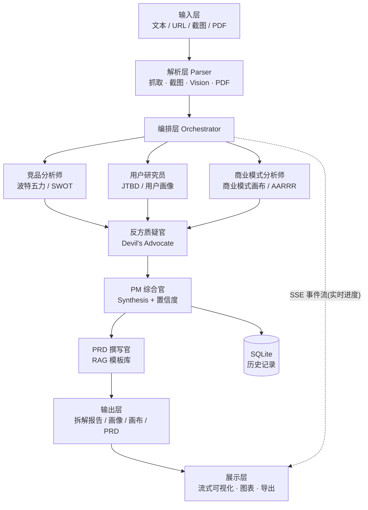
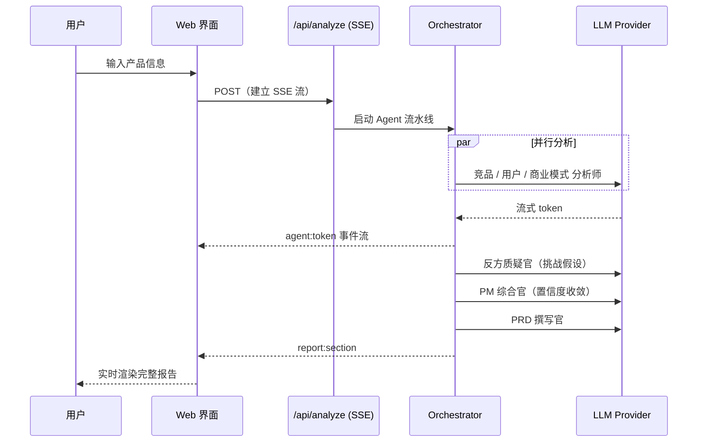

# Key · AI 产品拆解助手 —— 产品设计规格

> 日期：2026-09-12
> 状态：设计已获用户批准，待生成实现计划
> 定位：产品界面分析与视觉拆解工作区 —— 本文档是初版「产品拆解」能力的历史设计稿，记录当时的设计决策

---

## 1. 需求提炼（用户原话）

用户希望做一个 **AI 产品拆解助手**：

- 让这个产品"担任产品经理"——不仅能**分析一个给定产品**，也能**对用户的想法 / 需求进行延申**。
- 用途：把「分析一个产品」的过程做成**可解释、可追责**的产品能力。
- 形式：**Web 应用**（最像真实产品，便于演示）。
- 希望"细节一点、不断增加功能、变得更全能"，并**参考 GitHub 同方向的开源项目**把好的设计吸收进来。

### 目标（Goals）

1. 建成一个可在线访问、可现场演示的 Web 应用，展示 AI 产品经理的核心能力闭环。
2. 分析过程**可解释**（不是黑盒调 API）——这是本项目最重要的差异化。
3. 输出覆盖产品经理日常交付物：竞品/功能拆解、用户画像与 JTBD、商业模式画布、可直接开发的 PRD。
4. 架构清洁、模块可独立测试，代码本身即可作为"工程素养"的证明。

### 非目标（Non-Goals）

1. 不做多用户账号体系 / 权限 / 团队协作（当前产品定位不需要，YAGNI）。
2. 不做商业化（支付、计费、多租户）。
3. 不追求支持任意语言——产品界面与输出以**中文**为主。
4. 不自研大模型，只做 Provider 抽象对接现成 API。
5. 第一版不追求移动端完美适配（桌面优先，响应式作为加分项）。

---

## 2. 产品定位：双模式 AI 产品经理

| 模式 | 输入 | 输出 |
|---|---|---|
| **拆解模式（Teardown）** | 产品名称 / 描述 / URL / 截图 / PDF | 结构化拆解报告（竞品、用户、商业模式、策略） |
| **共创模式（Co-create）** | 一个想法 / 需求 / 一句话点子 | 需求延申、追问、发散、风险提示，最终产出 PRD |

一句话定位：**Key —— 把任何产品拆成关键洞察（Key · 让每个产品都讲得清）。**

目标用户：产品经理、创业者。

---

## 3. 技术栈与选型理由

| 层 | 选型 | 理由 |
|---|---|---|
| 框架 | **Next.js 15（App Router）+ TypeScript** | 前后端一体、SSE 流式天然支持、Vercel 一键部署，打开链接即可体验 |
| 样式 | Tailwind CSS + shadcn/ui | 快速产出"产品级"观感；组件可控、无黑盒 |
| 动效 | Framer Motion | 分析流水线的实时动效是演示高光 |
| LLM | 自研 **Provider 抽象**（OpenAI 兼容协议） | 一套接口切 OpenAI / DeepSeek / 通义 / 智谱，不锁定厂商 |
| 数据 | SQLite + Prisma | 本地零依赖、支持历史记录；演示环境无需外部数据库 |
| 图表 | Recharts | 五力 / 画布 / AARRR 的可视化 |
| 输入解析 | cheerio / readability（URL）、Playwright（截图）、pdf-parse（PDF）、多模态 LLM（图片） | 覆盖四类输入源 |
| 导出 | Markdown → PDF | 报告可下载，演示加分 |
| 测试 | Vitest（单元 + 集成）、Playwright（e2e） | 见第 9 节测试策略 |

**Agent 编排不引入 LangGraph / CrewAI**：自研轻量编排层，理由是编排逻辑简单（DAG 流水线 + 事件流），自研可控、易讲清楚设计决策，避免框架黑盒与额外运行时——对 AI 产品经理岗，"我亲手设计了编排"比"我调了个框架"更有说服力。

---

## 4. 系统架构



**分层职责**

- **输入层 / 解析层**：把异构输入统一成 `ProductBrief`（产品名、描述、截图、原文文本、来源类型）。
- **编排层**：按 DAG 调度 Agent，串流转事件到前端；负责并发、重试、降级。
- **展示层**：消费 SSE 事件，实时渲染"分析直播"，最终渲染结构化报告。

---

## 5. 数据流与 SSE 事件协议（产品的心脏）

分析请求 `POST /api/analyze`（建立 SSE 流），事件类型：

```
agent:start    { agentId, name }                    → 前端对应 Agent 卡片亮起
agent:token    { agentId, delta }                   → 逐字流式输出
agent:done     { agentId, output, confidence }      → 卡片完成，展示置信度
report:section { section, content }                 → 报告某板块就绪
error          { agentId, message }                 → 单 Agent 失败（不阻塞整体）
done           {}                                   → 全流程结束
```



高光画面：左侧 Agent 流水线逐个点亮，右侧报告实时生长。

---

## 6. Agent 编队与 I/O 契约

借鉴 MetaGPT 的 **SOP（每个 Agent 有明确输入/输出契约）** + Twister 的 **Critique ↔ Devil's Advocate 辩论机制**。

| Agent | 输入 | 输出 | 分析框架 |
|---|---|---|---|
| 竞品分析师 | ProductBrief | 竞品列表、竞争壁垒、威胁 | 波特五力 / SWOT |
| 用户研究员 | ProductBrief | 用户画像、JTBD、核心场景 | JTBD |
| 商业模式分析师 | ProductBrief | 收入结构、成本、增长引擎 | 商业模式画布 / AARRR |
| **反方质疑官** | 前三者输出 | 反驳点、被质疑的假设、反驳证据 | Devil's Advocate |
| PM 综合官 | 全部 + 质疑 | 收敛结论、各结论**置信度** | — |
| PRD 撰写官 | 综合结论 | PRD（用户故事 + 验收标准 + 指标） | RAG 模板库 |

每个 Agent 的 profile（系统提示词 + 框架模板）统一放在 `lib/frameworks/`，与执行逻辑分离，便于单独测试与迭代。

---

## 7. 目录结构

```
KEY/
├─ app/
│  ├─ page.tsx                 # 输入页（文本 / URL / 截图 / PDF）
│  ├─ analyze/[id]/page.tsx    # 分析过程页（实时直播）
│  ├─ report/[id]/page.tsx     # 报告页 + 导出
│  ├─ api/analyze/route.ts     # SSE 流式分析入口
│  ├─ api/parse/route.ts       # 输入解析（URL / 图片 / PDF）
│  ├─ api/export/route.ts      # 导出
│  └─ layout.tsx
├─ lib/
│  ├─ agents/
│  │  ├─ orchestrator.ts       # DAG 调度 + 事件流
│  │  ├─ market.ts             # 竞品分析师
│  │  ├─ user-research.ts      # 用户研究员
│  │  ├─ business.ts           # 商业模式分析师
│  │  ├─ devils-advocate.ts    # 反方质疑官
│  │  ├─ synthesis.ts          # PM 综合官
│  │  └─ prd.ts                # PRD 撰写官
│  ├─ llm/
│  │  ├─ provider.ts           # Provider 抽象接口
│  │  └─ providers/            # openai / deepseek / qwen / zhipu
│  ├─ frameworks/              # 五力 / SWOT / JTBD / 画布 / AARRR 提示词库
│  ├─ parsers/                 # URL 抓取 / PDF / Vision
│  └─ types/                   # 共享契约类型（事件、Agent I/O）
├─ components/
│  ├─ agent-pipeline.tsx       # 实时 Agent 流水线可视化
│  ├─ report-sections/         # 报告各板块组件
│  └─ ui/                      # shadcn 组件
├─ prisma/schema.prisma
└─ docs/superpowers/specs/
```

**边界原则**：每个 Agent 是一个纯函数式单元（ProductBrief + 依赖 → 输出），可脱离 UI 与网络独立测试；编排层只负责调度，不含业务提示词。

---

## 8. 错误处理与降级

| 故障 | 处理 |
|---|---|
| 单个 Agent 失败 | **不阻塞整体**：该板块标记「分析失败」，其余继续 |
| LLM 超时 / 限流 | 指数退避重试；仍失败则降级返回部分结果并标记 |
| URL 抓取失败 | 提示用户改用「文本输入」模式 |
| 缺少 API Key | 引导至配置页，明确说明需要哪个厂商的 key |
| SSE 流中断 | 前端按 `analysisId` 重连，从已完成 Agent 处续播 |
| 输出不是合法 JSON | 结构校验失败则回退到文本模式并标注 |

核心不变量：**任何单点失败都不能让整个分析会话崩溃。**

---

## 9. 测试策略

- **单元测试（Vitest）**：Agent 输出解析、prompt 构建、SSE 事件序列化、框架模板渲染。
- **集成测试（Vitest）**：用 **stub LLM server**（可录制回放）跑完整 orchestrator，断言事件序列符合第 5 节协议。
- **端到端（Playwright）**：输入 → 分析 → 报告渲染的完整路径。
- **关键纪律**：至少一个**不 mock 中间层**的端到端测试——从输入直通报告，验证完整数据路径，而非逐层 mock 的假绿。
- **诚实门禁**：跑不了的测试显式标注「未验证」，不以"看起来对"代替证据。

---

## 10. 分波交付路线

| 波次 | 内容 | 出口（可演示） |
|---|---|---|
| **Wave 0** | 脚手架 + LLM Provider 抽象 | 一个能调通模型的页面 |
| **Wave 1** | 核心闭环：文本输入 → 多 Agent 分析 → 流式报告 | 第一个能跑的端到端流程 |
| **Wave 2** | 分析框架套件（五力/SWOT/JTBD/画布/AARRR）+ 可视化 | 专业度展示 |
| **Wave 3** | 辩论机制 + 置信度 | 差异化亮点 |
| **Wave 4** | 多模态输入（URL / 截图 / PDF） | 输入能力完整 |
| **Wave 5** | PRD 直出（RAG 模板）+ 导出 + 历史记录 | 交付物完整 |
| **Wave 6** | 演示打磨（动效、空状态、错误兜底、样例数据） | 演示就绪 |

每波独立可演示，避免"处处半成品"。

---

## 11. 竞品借鉴来源（GitHub 调研，附出处）

| 来源 | 借鉴点 |
|---|---|
| brehndanknox/Twister | 多 Agent 流水线 + Critique ↔ Devil's Advocate **辩论机制** + 置信度打分 + 逐 Agent 流式 UI（README 原文：辩论是核心创新） |
| kawchar85/Automated_Market_Analyzer_using_Multi_Agent_LLM | 竞品自动发现 + SWOT + PDF 导出 |
| geekan/MetaGPT | SOP 化流水线：每个 Agent 明确的输入/输出契约 |
| Ishanvi04/prd-generator | 两 Agent 产出 PRD + **RAG 检索专业 PRD 模板库** |

**差异化（相对现有方案）**：
1. 分析框架**成套**（五力 + SWOT + JTBD + 画布 + AARRR），Twister 仅定位/策略。
2. **中文 PRD 直出** + RAG 模板库。
3. **双模式**（拆解 + 共创延申），现有方案多为单向拆解。
4. **历史记录**，支持同一产品多版本对比。

---

## 12. 风险与开放问题

| 风险 | 影响 | 缓解 |
|---|---|---|
| 多 Agent 串行导致分析耗时长 | 演示等待久 | 前三分析并行；流式输出让过程可见；提供"快速模式" |
| LLM 输出不稳定（非结构化） | 报告渲染失败 | 强契约 + JSON 校验 + 文本兜底 |
| URL 抓取受反爬限制 | 输入源失效 | 优雅降级到文本输入；截图走独立通道 |
| 演示时网络/额度异常 | 演示翻车 | 预置"样例数据回放"演示模式，断网也能演示完整流程 |
| 范围过大导致半成品 | 交付质量 | 严格按 7 波推进，每波可独立演示 |

**开放问题（实现阶段确定）**：
- 默认模型厂商选哪家（用户持 OpenAI/DeepSeek/通义/智谱 key，Wave 0 决定默认值）。
- RAG 模板库首版用内置静态模板还是向量检索（YAGNI 倾向：先内置模板，Wave 5 视需要升级）。

---

## 13. 未来扩展（Backlog，非本期）

- 竞品横向对比模式（一次分析多个产品并对比）
- 报告分享链接 / 协作批注
- 移动端完整适配
- 自有知识库（上传行业报告作为分析上下文）
